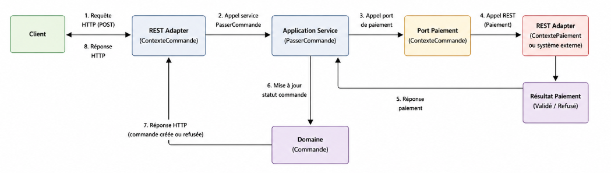
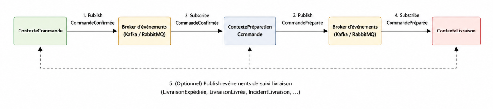

# Design des intégrations inter-contextes

## Intégration REST

### Schéma (conceptuel)

---

### Narration

Lorsqu’un client passe une commande, une requête HTTP est envoyée au ContexteCommande.
L’adapter REST traduit cette requête en commande métier et appelle le service applicatif PasserCommande.
Ce service orchestre la création de la Commande et déclenche une demande de paiement.

Le ContexteCommande utilise un port de paiement pour appeler un service externe via REST.
L’adapter REST du ContextePaiement (ou d’un prestataire externe) traite la demande et renvoie un résultat.
Ce résultat est ensuite interprété par le service applicatif pour mettre à jour le StatutCommande.

Si le paiement est validé, la commande passe à l’état "Payée".
Sinon, elle est refusée ou annulée. La réponse finale est ensuite renvoyée au client.

## Intégration par événements

### Schéma (conceptuel)

---

### Narration

Une fois le paiement validé, le ContexteCommande publie un événement métier "CommandeConfirmée".
Cet événement est envoyé sur un broker de messages comme Kafka ou RabbitMQ.

Le ContextePréparationCommande est abonné à cet événement et déclenche la préparation de la commande.
Une fois la préparation terminée, il publie un nouvel événement "CommandePréparée".

Le ContexteLivraison consomme cet événement pour initier la livraison du colis.
Cette approche permet de découpler les contextes et d’éviter les appels directs.

Chaque contexte réagit uniquement aux événements qui le concernent,
ce qui améliore la scalabilité et la résilience du système.

